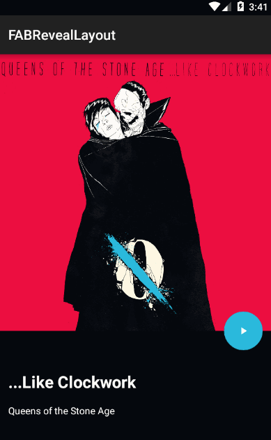

# FABRevealLayout 
[](https://android-arsenal.com/details/1/2459)

A layout to transition between two views using a Floating Action Button as shown in many Material Design concepts

### Usage


`FABRevealLayout` is very simple to use. You only need to include a `FloatingActionButton` from the Android Design Support Library and two views (namely main and secondary) within the layout. `FABRevealLayout` will position your views accordingly and provide the transition between them automatically.

``` xml
<com.truizlop.fabreveallayout.FABRevealLayout
    android:id="@+id/fab_reveal_layout"
    android:layout_width="match_parent"
    android:layout_height="@dimen/fab_reveal_height"
    >

    <android.support.design.widget.FloatingActionButton
        android:layout_width="wrap_content"
        android:layout_height="wrap_content"
        app:backgroundTint="@color/some_color"
        android:src="@drawable/some_drawable"
        />

    <RelativeLayout
        android:id="@+id/main_view"
        android:layout_width="match_parent"
        android:layout_height="match_parent">

		...
    </RelativeLayout>

    <RelativeLayout
        android:id="@+id/secondary_view"
        android:layout_width="match_parent"
        android:layout_height="match_parent">

		...
    </RelativeLayout>

</com.truizlop.fabreveallayout.FABRevealLayout>
```

Please note that the secondary view should have a transparent background so that the color animation works correctly.

### Further animation



If you want to animate the items inside the views of a `FABRevealLayout` or perform any other action when the transition is completed, you can register a listener.

``` java
private void configureFABReveal(FABRevealLayout fabRevealLayout) {
    fabRevealLayout.setOnRevealChangeListener(new OnRevealChangeListener() {
        @Override
        public void onMainViewAppeared(FABRevealLayout fabRevealLayout, View mainView) {}

        @Override
        public void onSecondaryViewAppeared(final FABRevealLayout fabRevealLayout, View secondaryView) {}
    });
}
```

Also, to trigger the reveal and hide animations programmatically, you can use the following methods:

``` java
fabRevealLayout.revealMainView();
fabRevealLayout.revealSecondaryView();
```

### Limitations

Currently, both main and secondary views inside `FABRevealLayout` should have the same height so that the animation works properly.

### Get it!

`FABRevealLayout` is available through JCenter. To be able to use this library in your project, add the following dependency to your `build.gradle` file:

```groovy
dependencies{
	compile 'com.truizlop.fabreveallayout:library:1.0.0'
}
```

### Acknowledgements

`FABRevealLayout` is based on this [proof of concept](https://github.com/saulmm/Curved-Fab-Reveal-Example) by Saúl Molinero and the explanations for [curved animations](http://graphics-geek.blogspot.com.es/2012/01/curved-motion-in-android.html) by Chet Haase.

## License


    Copyright 2015 Tomás Ruiz-López

    Licensed under the Apache License, Version 2.0 (the "License");
    you may not use this file except in compliance with the License.
    You may obtain a copy of the License at

       http://www.apache.org/licenses/LICENSE-2.0

    Unless required by applicable law or agreed to in writing, software
    distributed under the License is distributed on an "AS IS" BASIS,
    WITHOUT WARRANTIES OR CONDITIONS OF ANY KIND, either express or implied.
    See the License for the specific language governing permissions and
    limitations under the License.
